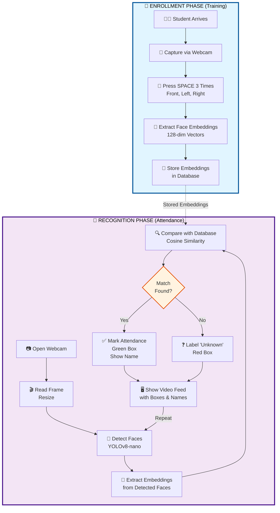
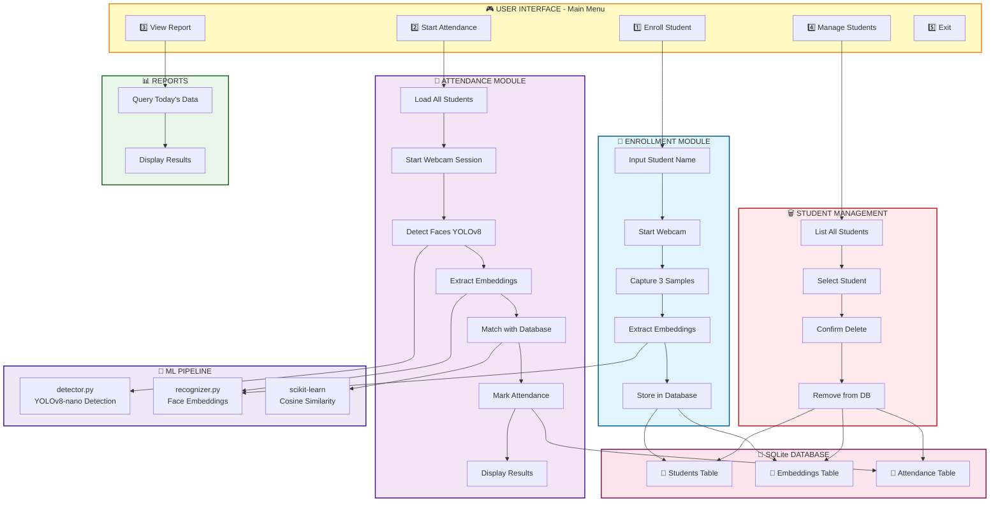
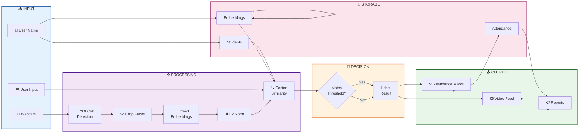

# 🎯 System Flow Diagrams

## Enrollment vs Recognition Phase

```mermaid
graph TD
    subgraph Training["📝 ENROLLMENT PHASE (Training)"]
        A["👨‍🎓 Student Arrives"]
        B["📸 Capture via Webcam"]
        C["🎯 Press SPACE 3 Times<br/>Front, Left, Right"]
        D["🧠 Extract Face Embeddings<br/>128-dim Vectors"]
        E["💾 Store Embeddings<br/>in Database"]
        
        A --> B
        B --> C
        C --> D
        D --> E
    end
    
    subgraph Recognition["🎥 RECOGNITION PHASE (Attendance)"]
        F["📷 Open Webcam"]
        G["🎬 Read Frame<br/>Resize"]
        H["🤖 Detect Faces<br/>YOLOv8-nano"]
        I["🧠 Extract Embeddings<br/>from Detected Faces"]
        J["🔍 Compare with Database<br/>Cosine Similarity"]
        K{"Match<br/>Found?"}
        L["✅ Mark Attendance<br/>Green Box<br/>Show Name"]
        M["❓ Label 'Unknown'<br/>Red Box"]
        N["🖥️ Show Video Feed<br/>with Boxes & Names"]
        
        F --> G
        G --> H
        H --> I
        I --> J
        J --> K
        K -->|Yes| L
        K -->|No| M
        L --> N
        M --> N
    end
    
    E -.->|Stored Embeddings| J
    N -->|Repeat| H
    
    style Training fill:#e1f5ff,stroke:#01579b,stroke-width:3px,color:#000
    style Recognition fill:#f3e5f5,stroke:#4a148c,stroke-width:3px,color:#000
    style K fill:#fff3e0,stroke:#e65100,stroke-width:2px
```

## Complete System Pipeline

```mermaid
graph TD
    subgraph UI["🎮 USER INTERFACE - Main Menu"]
        M1["1️⃣ Enroll Student"]
        M2["2️⃣ Start Attendance"]
        M3["3️⃣ View Report"]
        M4["4️⃣ Manage Students"]
        M5["5️⃣ Exit"]
    end
    
    subgraph Enroll["📝 ENROLLMENT MODULE"]
        E1["Input Student Name"]
        E2["Start Webcam"]
        E3["Capture 3 Samples"]
        E4["Extract Embeddings"]
        E5["Store in Database"]
    end
    
    subgraph Attend["🎥 ATTENDANCE MODULE"]
        A1["Load All Students"]
        A2["Start Webcam Session"]
        A3["Detect Faces YOLOv8"]
        A4["Extract Embeddings"]
        A5["Match with Database"]
        A6["Mark Attendance"]
        A7["Display Results"]
    end
    
    subgraph Management["🗑️ STUDENT MANAGEMENT"]
        SM1["List All Students"]
        SM2["Select Student"]
        SM3["Confirm Delete"]
        SM4["Remove from DB"]
    end
    
    subgraph Report["📊 REPORTS"]
        R1["Query Today's Data"]
        R2["Display Results"]
    end
    
    subgraph DB["💾 SQLite DATABASE"]
        DB1["👥 Students Table"]
        DB2["🧠 Embeddings Table"]
        DB3["📅 Attendance Table"]
    end
    
    subgraph ML["🤖 ML PIPELINE"]
        ML1["detector.py<br/>YOLOv8-nano Detection"]
        ML2["recognizer.py<br/>Face Embeddings"]
        ML3["scikit-learn<br/>Cosine Similarity"]
    end
    
    M1 --> E1
    M2 --> A1
    M3 --> R1
    M4 --> SM1
    
    E1 --> E2
    E2 --> E3
    E3 --> E4
    E4 --> E5
    
    A1 --> A2
    A2 --> A3
    A3 --> A4
    A4 --> A5
    A5 --> A6
    A6 --> A7
    
    SM1 --> SM2
    SM2 --> SM3
    SM3 --> SM4
    
    R1 --> R2
    
    E5 --> DB1
    E5 --> DB2
    A6 --> DB3
    SM4 --> DB1
    SM4 --> DB2
    SM4 --> DB3
    
    A3 --> ML1
    E4 --> ML2
    A4 --> ML2
    A5 --> ML3
    
    style UI fill:#fff9c4,stroke:#f57f17,stroke-width:2px
    style Enroll fill:#e1f5fe,stroke:#01579b,stroke-width:2px
    style Attend fill:#f3e5f5,stroke:#4a148c,stroke-width:2px
    style Management fill:#ffebee,stroke:#b71c1c,stroke-width:2px
    style Report fill:#e8f5e9,stroke:#1b5e20,stroke-width:2px
    style DB fill:#fce4ec,stroke:#880e4f,stroke-width:2px
    style ML fill:#ede7f6,stroke:#311b92,stroke-width:2px
```

## Data Flow Diagram

```mermaid
graph LR
    subgraph Input["📥 INPUT"]
        WC["🎥 Webcam"]
        UN["👤 User Name"]
        UI["🎮 User Input"]
    end
    
    subgraph Process["⚙️ PROCESSING"]
        YOL["🤖 YOLOv8<br/>Detection"]
        CROP["✂️ Crop Faces"]
        EMB["🧠 Extract<br/>Embeddings"]
        NORM["📊 L2 Norm"]
        SIM["🔍 Cosine<br/>Similarity"]
    end
    
    subgraph Decision["🎯 DECISION"]
        MATCH{"Match<br/>Threshold?"}
        LABEL["Label<br/>Result"]
    end
    
    subgraph Storage["💾 STORAGE"]
        STUDENTS["Students"]
        EMBED["Embeddings"]
        ATTEND["Attendance"]
    end
    
    subgraph Output["📤 OUTPUT"]
        VIDEO["📺 Video Feed"]
        MARKS["✅ Attendance Marks"]
        REPORTS["📋 Reports"]
    end
    
    WC --> YOL
    UN --> EMBED
    UI --> SIM
    
    YOL --> CROP
    CROP --> EMB
    EMB --> NORM
    NORM --> SIM
    
    SIM --> MATCH
    MATCH -->|Yes| LABEL
    MATCH -->|No| LABEL
    
    LABEL --> VIDEO
    LABEL --> MARKS
    
    UN --> STUDENTS
    EMBED --> EMBED
    MARKS --> ATTEND
    
    STUDENTS --> SIM
    EMBED --> SIM
    ATTEND --> REPORTS
    
    VIDEO --> Output
    MARKS --> Output
    REPORTS --> Output
    
    style Input fill:#e3f2fd,stroke:#0d47a1,stroke-width:2px
    style Process fill:#f3e5f5,stroke:#4a148c,stroke-width:2px
    style Decision fill:#fff3e0,stroke:#e65100,stroke-width:2px
    style Storage fill:#fce4ec,stroke:#880e4f,stroke-width:2px
    style Output fill:#e8f5e9,stroke:#1b5e20,stroke-width:2px
```
